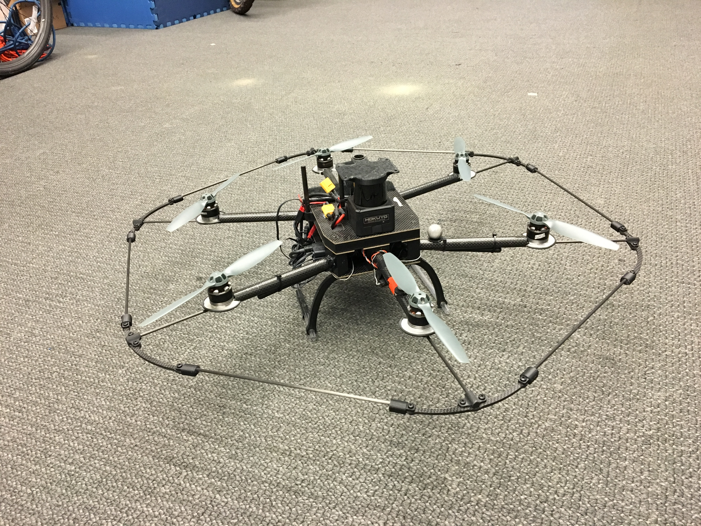

# Quiz 1.1

1. Which of these factors has NOT contributed to the rapidly-increasing commercial interest in multi-rotor vehicles?

- [ ] Mechanical simplicity
- [ ] Ability to hover in mid air
- [ ] Inexpensive components
- [ ] Efficiency in forward flight

2. In how many ways can you translate and rotate this robot in free space? Enter your answer as a numeric value (e.g. 1 instead of one). 

 

 
 

3. How many independent control inputs does the vehicle shown above have? 

- [ ] 4, since it is similar to a quadrotor, except with more motors
- [ ] 6, because there are six motors
- [ ] 6, because a rigid body has six degrees of freedom

4. Based on the lecture content in this course, which of these components are incorporated in commercial products mentioned in lecture such as the DJI Phantom or the Parrot Bebop? (Select all that apply.)

- [ ] State estimation
- [ ] Planning to avoid obstacles
- [ ] Autonomous control
- [ ] Mapping

5. An Inertial Measurement Unit (IMU)  is an important sensor used in aerial robotics. A typical IMU will contain an accelerometer and a rate gyro. Which of the following information does a robot get from an IMU? (Select all that apply. Choose only quantities that are directly reported by the IMU. Do not include quantities that can be computed from the IMU measurements but cannot be obtained directly. Additional research to find information about IMUs is allowed and encouraged!)  (Select all that apply)

- [ ] Position
- [ ] Orientation
- [ ] Linear velocity
- [ ] Angular velocity
- [ ] Linear acceleration
- [ ] Angular acceleration

6. What does  Simultaneous Localization And Mapping (SLAM) software do? (Select all that applies.)

- [ ] Estimates the position and orientation of the robot with respect to the environment
- [ ] Navigates the robot in a cluttered environment
- [ ] Controls the robot's flight through the environment
- [ ] Causes the robot to avoid obstacles in the environment
- [ ] Estimates the location of features in the environments