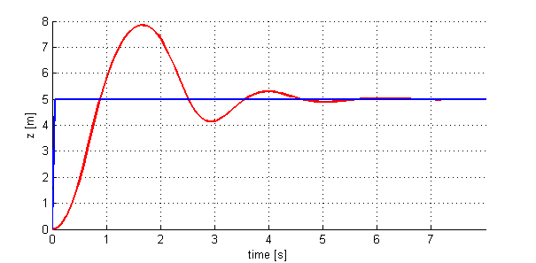

# Quiz 1.2

1. You observe the response of a system shown in the figure below
 
 <p align="center">
 
 </p>

What should you do to decrease the oscillations in the response?

- [ ] Increase the derivative gain (Kv)
- [ ] Decrease the proportional gain (Kp)
- [ ] Increase the integral gain (Ki)
- [ ] Increase the proportional gain (Kp)

2. Download the simulation GUI attached below and unzip the contents into a folder of your choice. This is NOT the same GUI that was used in the in-video questions.

Note: If the GUI plots do not show up and you are currently running MATLAB on Chrome, try running the GUI on a different browser (e.g. Firefox, Edge). 

`GainTuningQuiz Folder`

Open MATLAB in the directory where the unzipped files are and type "runsim" in the MATLAB Command Window to start the GUI.

Given that the derivative gain Kv=5, find the proportional gain Kp (up to two decimal places) such that the rise time is less than 1s and overshoot less than 5%.

3. Assuming we are using the F550 + E310 + 4 cell battery with a 200g onboard computer and a laser (270g), what is the thrust to weight ratio of the platform? (We use the term "weight" and "thrust" loosely. Except for Thrust/Weight and Propeller, all units are in grams)

 <p align="center">
 
 </p>

 4. Why don’t all the rotors of a quadrotor spin in the same direction?

- [ ] Spinning all rotors in the same direction will cause the robot to constantly rotate.  
- [ ] Spinning all rotors in the same direction does not allow the quadrotor to fly upside down.  
- [ ] Spinning all rotors in the same direction uses more battery power.  

5. Given that a quadrotor consumes 200 W to carry a mass of 1kg, which component contributes more to the quadrotor's total power consumption? 

A 100g computer that consumes 40W for operation or a 200g laser which consumes 20W for operation?

- [ ] The computer.
- [ ] The laser.
- [ ] Both contribute the same to the power consumption.


```Also there are other MATLAB quiz which you can see in this folder : 
1. StoppingDistanceExercise
2. ThrustWeightExercise 
```