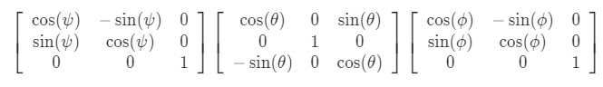

# Quiz 2.1

1. Which of the following matrices are rotation matrices?
 
 

 
 

2. What is the ZYZ euler angle representation,(ψ, θ, ϕ), for the following rotation matrix?
 

 
 

Recall that this rotation matrix can be seen as a combination of three rotations:
 

 
 

- [ ] (0.9, 0.1, 0.1)  
- [ ] (0.2, 0.1, 0.6)
- [ ] (0.1, 0.1, 0.2)  
- [ ] (0.7, 0.4, 0.2) 

3. At a given time t, the rotation matrix R has the value: 
 

 
 

The angular velocity ω^b at that same time t is:
 

 
 

 What is ω^s?
 

 
 

 4. Given the following rotation matrix, what is the corresponding axis-angle representation assuming the angle is restricted to [0, π]?
 

 
 

- [ ] u=[−sqrt(2)/2, 0, sqrt(2)/2]T, ϕ=2
- [ ] u=[sqrt(2)/2, −sqrt(2)/2, 0]T, ϕ=0.8  
- [ ] Not enough information is given to uniquely determine the axis-angle representation
- [ ] u=[−sqrt(2)/2, 0, sqrt(2)/2]T, ϕ=0.8 
- [ ] u=[sqrt(2)/2, 0, −sqrt(2)/2]T, ϕ=2

5. Given the following rotation matrix, what is the corresponding axis-angle representation assuming the angle is restricted to [0, π]?

 

 
 

 - [ ] u=[−0.9066, 0.9066, 09066]T, ϕ=.2
 - [ ] u=[−0.9066, −0.9066, −0.9066]T, ϕ=π
 - [ ] Not enough information is given to uniquely determine the axis-angle representation
 - [ ] u=[−sqrt(3)/3, sqrt(3)/3, −sqrt(3)/3]T, ϕ=.2
 - [ ] u=[sqrt(3)/3, sqrt(3)/3, −sqrt(3)/3]T, ϕ=π

 6. Recall the transformation from the in-video exercises:

  

 
 

Assuming p and q represent the vectors from the origin to the points P and Q respectively, which of the following are correct expressions for the cross-product of the rotated vectors p′×q′?

- [ ] p×q
- [ ] g∗(p×q)
- [ ] g∗(p)×g∗(q)