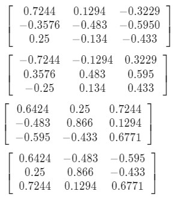

# Quiz 4

1. What sensors would you rely on for state estimation in an office building with vertical walls without too much clutter due to furniture when the lighting is poor?

- [ ] IMU
- [ ] GPS
- [ ] Cameras
- [ ] Laser Scanners

2. Given a desired thrust vector t=sin(30∘)cos(45∘)a1+sin(30∘)sin(45∘)a2+cos(30∘)a3 and a desired yaw angle, ψdes=45∘. Compute the desired rotation matrix, Rdes.

 

 
 

3. What is the rotation matrix that describes the attitude error if the current rotation matrix is given by R and the desired rotation matrix is Rdes:

 

 
 

  

 
 

4. What  sensors are most likely to fail when operating indoors in a building with glass walls?

- [ ] IMU
- [ ] Cameras
- [ ] GPS
- [ ] Laser Scanners

5. What  sensors are most likely to fail when the robot is flying outdoors, close to the ground near the wall  of a tall building?

- [ ] IMU
- [ ] GPS
- [ ] Laser Scanners
- [ ] Cameras