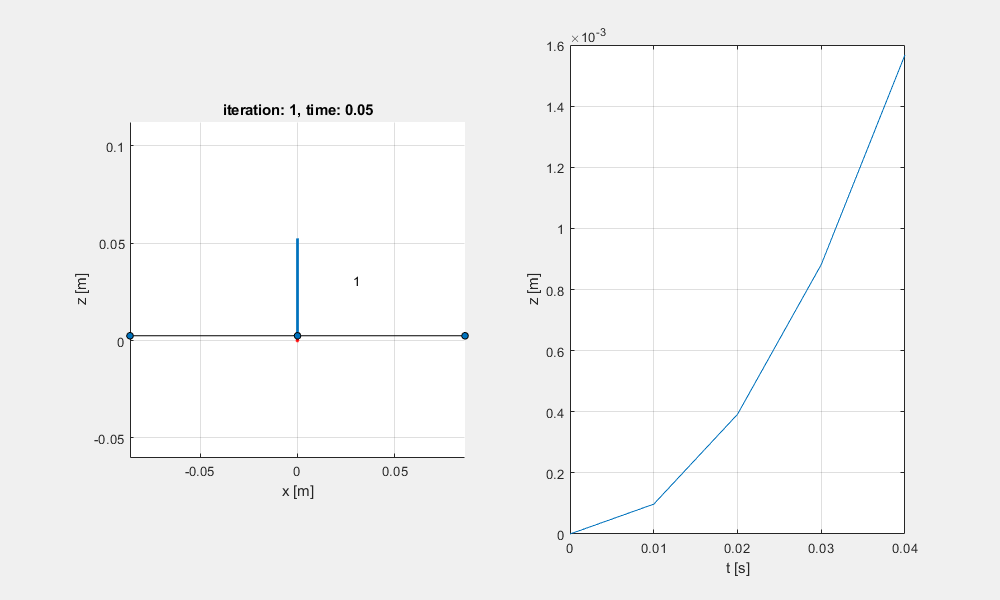
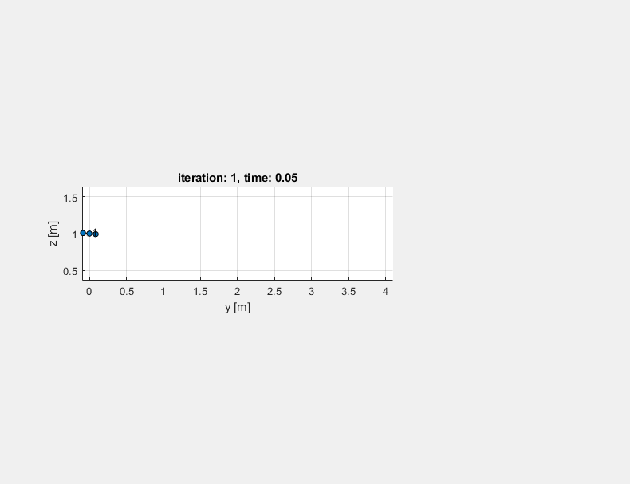
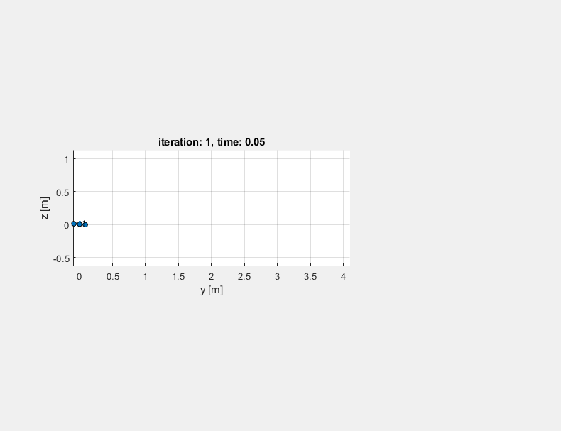

# RoboticsSpecialization-AerialRobotics

This repository contains programming assignments, quizzes and my notes for the Robotics Specialization: Aerial Robotics online course which is held by **Vijay Kumar from University of Pennsylvania** in Coursera platform. 

`Note: If you are a student in this course, please do not plagiarize this work as it violates the Honor Code.`

You will find three assignments:

 * Programming Assignment 1 : The goal for this task is to develop a PD controller for Hover control in a quadrotor.
 
 

 
 

  
 * Programming Assignment 2 : The goal for this task is to design a PD controller to follow two trajectory in 2D space: Straight Line and Sine Wave.
 
 

 
 
 

 * Programming Assignment 3 : The goal for this task is to design a PD controller for a quadrotor in 3D space: given a set of waypoints.
 
 

 
 

 
## Course Syllabus

- [x] Week 1 - Introduction to Aerial Robotics
* Introduction
* Energetics and System Design 

- [x] Week 2 - Geometry and Mechanics
* Quadrotor Kinematics Modeling
* Quadrotor Dynamics Modeling

- [x] Week 3 - Planning and Control
* Linear Control (PID Controllers)
* Trajectory Generation Motion Planning

- [x] Week 4 - Advanced Topics
* Sensing and Estimation
* Nonlinear Control
* Control of Multiple Robots

## For more information:

 * Coursera Page for [Robotics specialization](https://www.coursera.org/specializations/robotics) 
 * Coursera Page for [Aerial Robotics](https://www.coursera.org/learn/robotics-flight/) 
